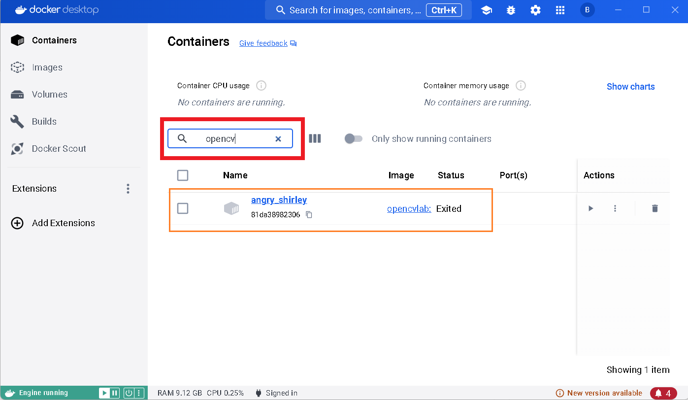

How to Change Docker Container Name


To change the name of a Docker container, you can use the --name option when running the docker run command. This option allows you to specify a custom name for the container.

Steps to Name Your Docker Container
Stop and Remove Any Running Container:


If you have a container already running with the same name, stop and remove it first:

```
docker stop <container_name_or_id>
docker rm <container_name_or_id>
```

Run the Docker Container with a Custom Name:
Use the --name option to specify the name of the container when running it:

```
docker run -it --rm -p 8888:8888 --name opencvlab_container opencvlab
```

In this example, opencvlab_container is the custom name given to the container. You can replace it with any name you prefer.

Example Commands
Running the Docker Container with a Custom Name:

```
docker run -it --rm -p 8888:8888 --name opencvlab_container opencvlab
```

Attaching to the Container in VSCode:

Open the Docker extension in VSCode.
Find the container named opencvlab_container under the "Containers" section.
Right-click on the container and select "Attach Shell".
Verify the Custom Container Name
To verify that your container is running with the custom name, you can list the running containers:

```
docker ps
```

You should see the container listed with the name you specified (opencvlab_container).

By following these steps, you can run your Docker container with a custom name and manage it more easily in your development environment.
